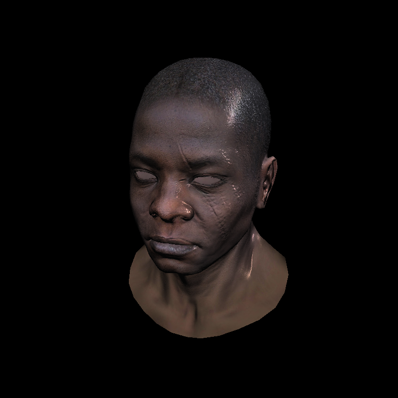

# Tiny Rasterizer

A software rasterizer based on the OpenGL rendering pipeline. 

- OpenGL rendering pipeline
- Diffuse, normal, specular map

## Credits

- https://github.com/ssloy/tinyrenderer
- https://www.scratchapixel.com/lessons/3d-basic-rendering/rasterization-practical-implementation